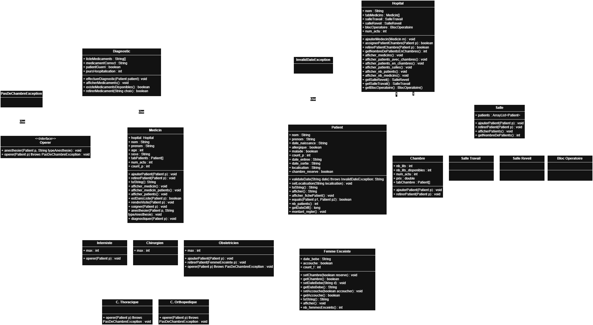

# tdHospital - Hospital Management System

This project is a simulation of a hospital management system that models the operation of doctors, patients, and hospitals. It includes functionalities such as creating patients, managing doctors, diagnostics, admissions, and surgeries.

## Features
- Registration of doctors, patients, and hospitals.
- Association of doctors with patients.
- Management of patient admissions and room allocation.
- Simulation of diagnostics and medical procedures.
- Counting patients and managing specific admissions (e.g., pregnant women).

## Diagram
Below is the diagram representing the system's main structure and class relationships:



## Prerequisites
 - Java 8 or later
 - Compatible IDE

## Installation
1. Clone this repository:
```
git clone https://github.com/luanals/tdHopital.git
```
2. Open the project in your preferred IDE.
3. Ensure the environment is configured for Java 8 or later.

## How to Run
1. Compile all the classes in the project.
2. Run the main class `SimulationHopital`:
```
java SimulationHopital
```
3. The program will:
 - Create instances of hospitals, doctors, and patients.
 - Simulate diagnostics, admissions, and surgeries.
 - Display the status of doctors, patients, and the hospital in the console.

## Future Improvements
Planned changes to enhance the system:

1. Interface:
 - [ ] Create a graphical user interface (GUI) or command-line interface (CLI) for interacting with the system.

2. Data Validation:
 - [ ] **Fix `Chambre` vs. `Salle` inconsistency:** Ensure consistent terminology throughout the code and logic.
 - [ ] Improve validation of dates in the `Patient` class and its subclasses:
   - [ ] Validate birth dates.
   - [ ] Handle entry and exit dates properly.
 - [ ] Handle errors during patient creation, including:
   - [ ] A pregnant woman (`FemmeEnceinte`) should not have `accouche=true` upon creation.
   - [ ] If a pregnant woman (`FemmeEnceinte`) already knows the delivery date, a room reservation must be mandatory.
 - [ ] Decide if a patient can exist without being assigned to a doctor:
   - If not, implement a `try-catch` to ensure the patient is only created after being added to a doctor.
    
3. Hospital Resource Management:
- [ ] Implement a more robust allocation logic for rooms and operating theaters.
- [ ] Add a `length_of_stay` variable to calculate hospitalization duration correctly, considering that in real scenarios, `date_sortie` likely starts as `null`.
  
4. Code Optimization:
 - [ ] Remove duplicate functionality, such as:
   - [ ] `f.setChambre` and `h.assignerChambre(f)` (unify the logic).
   - [ ] `afficherPatients` (generalize and reuse across classes).
 - [ ] Create `get` and `set` methods, making attributes private and encapsulating access.
 - [ ] Handle common errors, such as:
   - [ ] Avoid adding the same person twice to a list.
   - [ ] Check for `null` values to prevent `NullPointerException`.
    
5. Reports and Statistics:
 - [ ] Generate detailed reports about doctors, patients, and resources.
 - [ ] Display summarized information using charts or tables.

6. Documentation and Testing:
 - [ ] Add detailed comments in the code.
 - [ ] Create more critical cases, such as duplicate patients, incomplete data, and logic errors.

7. New Features:
 - [ ] Support exporting data in CSV or JSON format.
 - [ ] Add more types of doctors and patients, expanding the hospital model.

## Project Structure
### Main Classes
 - `Hopital`: Manages the list of doctors and patients.
 - `Medecin` **and subclasses**: Represent different types of doctors (Chirurgiens, Obstetricien, Interniste).
 - `Patient` **and** `FemmeEnceinte`: Represent hospital patients, including specific characteristics like pregnancy.
 - `Diagnostic`: Performs patient diagnostics.
 - `SimulationHopital` : Main execution class simulating the system's functionalities.
### Exceptions
 - `InvalidDateException`: Handles errors related to invalid dates.
 - `PasDeChambreException`: Indicates a lack of room in a patient file.
